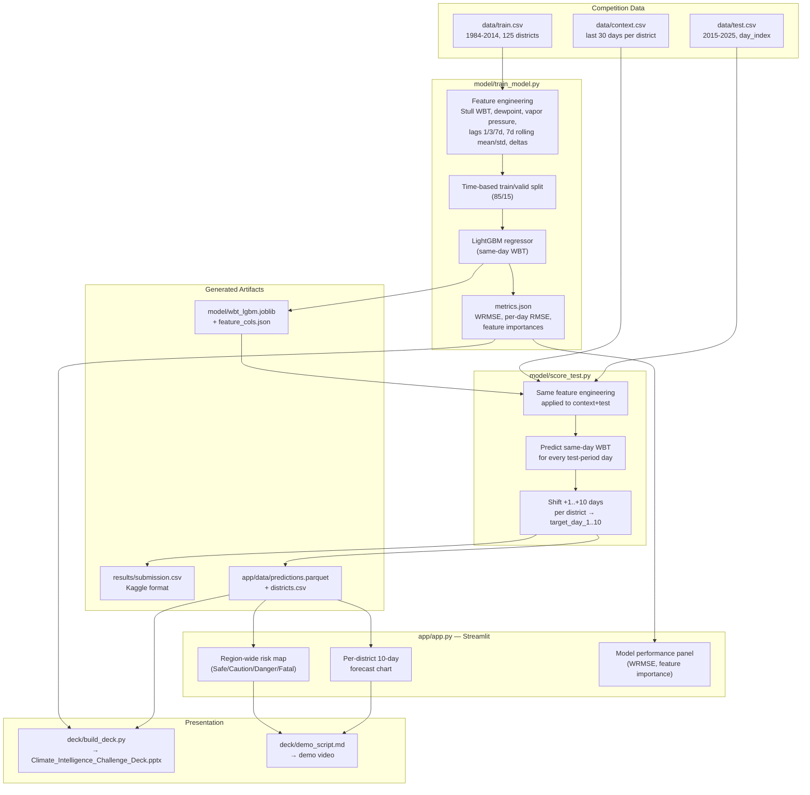

# UP Heat-Risk Forecaster

Prototype for the **IIIT Lucknow Climate Intelligence Challenge 2026** (hosted by Aether,
the AI/ML Club of IIIT Lucknow) — 10-day-ahead Wet-Bulb Temperature (WBT) forecasting
across 125 districts of Uttar Pradesh & neighboring regions.

## Problem recap

WBT combines temperature and humidity into a single heat-stress signal:

| WBT | Risk |
|---|---|
| < 28°C | Safe |
| 28–32°C | Caution |
| 32–35°C | Danger |
| > 35°C | Fatal (unsurvivable beyond ~6h) |

Given 30 days of daily meteorological features per district, predict max WBT for each of
the next 10 days. Scored with weighted RMSE (weights decay linearly 1.0 → 0.1, Day 1 → Day 10).

## Approach

A **LightGBM** regressor predicts same-day WBT from NASA POWER features (temperature,
humidity, soil moisture, radiation, wind) plus engineered lag/rolling features
(1/3/7-day lags, 7-day rolling mean/std, day-over-day deltas), computed per district.

Because the meteorological drivers for the test period are themselves known NASA
reanalysis values (not forecasts), the model scores every day directly rather than
recursively forecasting 10 steps forward — this avoids compounding error. The 10-day-ahead
target vector for a given day is simply the model's same-day predictions on the following
10 days. `context.csv` seeds each district's first 30-day lag window before the test period
begins, exactly as the competition rules require.

This project also has an earlier deep-learning experiment (`experiments/weather_tcn_lstm.py`,
LSTM + LightGBM + CatBoost ensemble, and `experiments/competition_pipeline.py`) exploring the
same problem — the LightGBM path in `model/` was kept for the deployed prototype because it
trains fast on CPU and hits comparable accuracy.

## Architecture



## Repo layout

```
data/
  train.csv                 # NOT committed (262MB, over GitHub's 100MB limit) -- download from Kaggle
  test.csv, context.csv, sample_submission.csv   # competition data
model/
  train_model.py     # trains the LightGBM model on data/train.csv, saves model + metrics
  score_test.py       # scores data/context.csv + data/test.csv, writes results/submission.csv + app data
  wbt_lgbm.joblib      # trained model (generated)
  feature_cols.json    # feature list used by the model (generated)
  metrics.json         # validation WRMSE / per-day RMSE / feature importances (generated)
app/
  app.py               # Streamlit dashboard (the "live deployment")
  requirements.txt
  data/
    predictions.parquet  # compact scored output the app reads (generated)
    districts.csv         # district list + coordinates (generated)
results/
  submission.csv       # Kaggle submission (generated by score_test.py)
deck/
  build_deck.py, Climate_Intelligence_Challenge_Deck.pptx, demo_script.md
```

## Running it locally

```bash
pip install -r app/requirements.txt lightgbm scikit-learn joblib
py model/train_model.py     # trains model, ~3 min on CPU
py model/score_test.py      # writes results/submission.csv + app/data/*
streamlit run app/app.py    # opens the dashboard at http://localhost:8501
```

`data/train.csv` is not committed to this repo (262MB, over GitHub's 100MB file limit) —
download it from the competition's Kaggle dataset page and place it at `data/train.csv`
before running `model/train_model.py`.

## Deploying the live demo (Streamlit Community Cloud, free)

1. Push this repo to GitHub (`data/train.csv` is excluded via `.gitignore` — see above).
   Only `app/data/predictions.parquet` and `app/data/districts.csv` are actually needed
   for the deployed app.
2. Go to [share.streamlit.io](https://share.streamlit.io), sign in with GitHub, click
   "New app", pick this repo, set the main file path to `app/app.py`.
3. Streamlit Cloud installs `app/requirements.txt` automatically and gives you a public
   `*.streamlit.app` URL — that's the "Live Deployment Link" deliverable.

## What the dashboard shows

- **Region-wide risk map** — all 125 districts plotted by relative coordinates, color-coded
  Safe/Caution/Danger/Fatal for any day in the 2015–2025 test window (slider).
- **Per-district 10-day forecast** — line chart with the WBT danger bands overlaid, plus
  peak/day-1/day-10 metrics and a risk badge.
- **Model performance panel** — validation WRMSE, per-horizon RMSE bar chart (showing the
  weighted-scoring priority on near-term accuracy), and top feature importances.

## Deliverables checklist

- [x] Presentation deck — see `deck/` (generate with `deck/build_deck.py`)
- [x] Live deployment — `app/app.py`, deploy per steps above
- [ ] Demo video — script in `deck/demo_script.md`, record screen capture of the app
- [x] GitHub repo — this repo

## Team

Built by **Lavesh Jadon**, **Gaurav Jha**, and **Akash Bernwal** for the IIIT Lucknow
Climate Intelligence Challenge 2026 (Aether).
